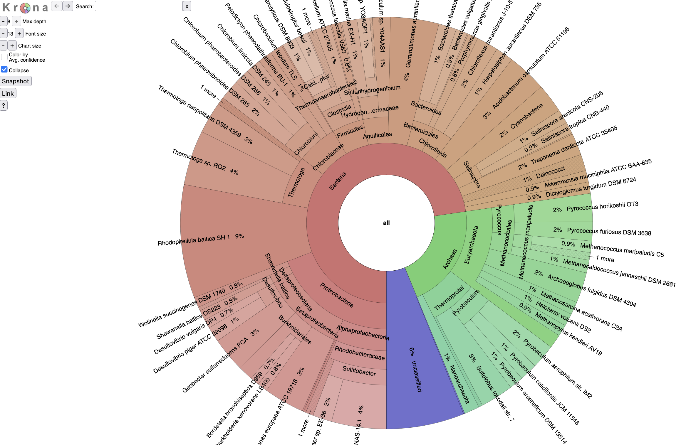

# taxburst: sunburst charts for taxonomy, based on Krona

**WARNING: alpha mode software. Use at your own risk.**

This is an update of Krona, written with the following goals in mind:

* liberate tax displays from the tyranny of NCBI taxonomy IDs and taxdump;
* support dynamic generation of Krona-style plots;
* rewrite in modern Python;
* support ~nicer multi-stage generation of XHTML;
* probably other things;

The output HTML is based on https://github.com/marbl/Krona.

All bugs are mine until proven otherwise.

Please file bugs and feature requests on [the issue tracker](https://github.com/taxburst/taxburst/issues).

## Examples

[A small example](https://taxburst.github.io/taxburst/pages/small.tax.html) - a test data set.

[A bigger example](https://taxburst.github.io/taxburst/pages/SRR606249.x.podar.tax.html) - SRR606249 against known reference genomes.

A screenshot:



## Install

```
pip install taxburst
```

## Run

```
taxburst examples/small.tax.csv -o small.tax.html
```
then open `small.tax.html` in a browser.

Currently the only input format accepted is the `csv_summary` format
from `sourmash tax metagenome` (see
[docs](https://sourmash.readthedocs.io/en/latest/command-line.html#sourmash-tax-metagenome-summarize-metagenome-content-from-gather-results)),
but that is pretty easy to change.

## Background and history

[Krona](https://github.com/marbl/Krona) is a super cool way to explore
taxonomic breakdowns of metagenomes. But it's kind of old, and isn't
being actively maintained. Moreover, it doesn't work easily with
GTDB or other non-NCBI taxonomies.

So, why not grab the JavaScript code and rewrite the preprocessing code?

Voila! 'taxburst'!

I'd call it Krona2 or something, but the licensing for Krona prohibits that,
to my understanding. Hence, 'taxburst'.

CTB July 2025
ctbrown@ucdavis.edu
