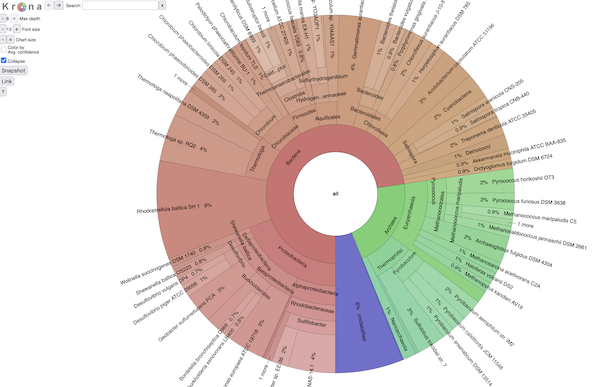

# taxburst: sunburst charts for taxonomy, based on Krona

<a href="https://pypi.org/project/taxburst/"></a>
[](http://bioconda.github.io/recipes/taxburst/README.html)

taxburst is a fork of the [Krona](https://github.com/marbl/Krona)
software, (see:
[Ondov, Bergman, and Philippy, 2011](https://bmcbioinformatics.biomedcentral.com/articles/10.1186/1471-2105-12-385)). It
produces static HTML pages that provide an interactive display of a
metagenomic taxonomy.

Here is an example screenshot:



Krona is a fantastic piece of software, but it has been unmaintained for
a number of years. Moreover, the input parsing code is written in Perl
and the default instructions require use of NCBI taxids.

The goal of taxburst is to update Krona to a maintained, documented
piece of software that can be adapted and adjusted in a variety of
ways.  This is still alpha mode software, to be used at your own risk.

Please file bugs and feature requests on [the issue tracker](https://github.com/taxburst/taxburst/issues).

Pull requests are welcome!

## Documentation

User and developer documentation is available at [taxburst.github.io/taxburst/](https://taxburst.github.io/taxburst/).

## Examples

Here are some examples of (interactive!) taxburst plots:

* [SRR11125891.SingleM.html](https://taxburst.github.io/taxburst/examples/SRR11125891.SingleM.html) - displaying the results of `singlem pipe` on SRR11125891, a pig gut microbiome.
* [SRR11125891.summarized.html](https://taxburst.github.io/taxburst/examples/SRR11125891.summarized.html) - `sourmash` taxonomic breakdown on SRR11125891.
* [SRR11125891.tax_annotate.html](https://taxburst.github.io/taxburst/examples/SRR11125891.tax_annotate.html) - genome-resolution taxonomic breakdown of SRR11125891.

## Install

Via pypi

```bash
pip install taxburst
```

or from bioconda

```bash
conda create -n taxburst -c bioconda taxburst
conda activate taxburst
```

## Example command lines

All data files are available in the GitHub repository under `examples/`.

### Using `sourmash tax metagenome` output - `summary_csv` format

An example using the summary_csv format
from `sourmash tax metagenome` (see
[tax metagenome docs](https://sourmash.readthedocs.io/en/latest/command-line.html#sourmash-tax-metagenome-summarize-metagenome-content-from-gather-results)),

```bash
taxburst examples/SRR11125891.summarized.csv \
    -o SRR11125891.summarized.html
```
then open `SRR11125891.summarized.html` in a browser.

### Using `sourmash tax annotate` output

An example using the with-lineages format
from `sourmash tax annotate` (see
[tax annotate docs](https://sourmash.readthedocs.io/en/latest/command-line.html#sourmash-tax-annotate-annotates-gather-output-with-taxonomy)

```bash
taxburst -F tax_annotate \
    examples/SRR11125891.t0.gather.with-lineages.csv \
    -o SRR11125891.tax_annotate.html
```
then open `SRR11125891.tax_annotate.html` in a browser.

### Using `singleM pipe` output

An example using the profile format
from `singlem pipe` (see
[singlem pipe docs](https://wwood.github.io/singlem/tools/pipe)):

```bash
taxburst -F singleM \
    examples/SRR11125891.singleM.profile.tsv \
    -o SRR11125891.singleM.html
```
then open `SRR11125891.singleM.html` in a browser.

## Background and history

[Krona](https://github.com/marbl/Krona) is a super cool way to explore
taxonomic breakdowns of metagenomes. But it's kind of old, and isn't
being actively maintained. Moreover, it doesn't work easily with
GTDB or other non-NCBI taxonomies.

So, why not grab the JavaScript code and rewrite the preprocessing code?

Voila! 'taxburst'!

I'd call it Krona2 or something, but the licensing for Krona prohibits that,
to my understanding. Hence, 'taxburst'.

## Citation information

When using taxburst, please cite the Krona paper:
[Interactive metagenomic visualization in a Web browser](https://bmcbioinformatics.biomedcentral.com/articles/10.1186/1471-2105-12-385),
Ondov et al., 2011.

---

CTB July 2025

ctbrown@ucdavis.edu
