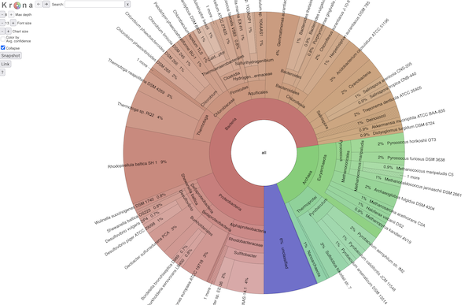

# taxburst documentation


<a href="https://pypi.org/project/taxburst/"></a>
[](http://bioconda.github.io/recipes/taxburst/README.html)

taxburst is a fork of the [Krona](https://github.com/marbl/Krona)
software ([Ondov, Bergman, and Philippy, 2011](https://bmcbioinformatics.biomedcentral.com/articles/10.1186/1471-2105-12-385)). It
produces static HTML pages that provide an interactive display of a
metagenomic taxonomy.

The goal of taxburst is to update Krona to a maintained, documented
piece of software that can be adapted and adjusted in a variety of
ways.  This is still beta mode software, to be used at your own risk.

Here is an example screenshot:



## Input formats

taxburst v0.3.0 (Aug 2025) has parsers for the following formats:

* sourmash `tax annotate` and `csv_summary` outputs;
* SingleM profile output;
* Krona format;
* nested dictionaries in JSON;

Please [file an issue](https://github.com/taxburst/taxburst/issues) if you
need support for an additional format!

## Support and help

Please file bugs and feature requests on [the issue tracker](https://github.com/taxburst/taxburst/issues).

Pull requests are welcome!

## Examples

Here are some examples of (interactive!) taxburst plots:

* [SRR11125891.SingleM.html](examples/SRR11125891.SingleM.html) - displaying the results of `singlem pipe` on SRR11125891, a pig gut microbiome.
* [SRR11125891.summarized.html](examples/SRR11125891.summarized.html) - `sourmash` taxonomic breakdown on SRR11125891.
* [SRR11125891.tax_annotate.html](examples/SRR11125891.tax_annotate.html) - genome-resolution taxonomic breakdown of SRR11125891.
* [SRR11125891.krona.html](examples/SRR11125891.krona.html) - krona-format input parsing output (produced by `sourmash tax metagenome`).

The input formats behind these taxburst plots can be found in `examples/`
folder in the top level of the git repo.  The README in that directory
contains some minimal documentation on how the examples were created.

## Install

taxburst is available on the Python Package Index (PyPI) under [pypi.org/project/taxburst](https://pypi.org/project/taxburst/).

To install it, run:

```bash
pip install taxburst
```

It is also available on Bioconda.

```bash
conda create -n taxburst -c bioconda taxburst
conda activate taxburst
```

## Authors

The original Krona software was developed by Brian Ondov, Nicholas
Bergman, and Adam Philippy.

taxburst is developed by Titus Brown. The HTML format is largely unchanged,
but the parsing front-end and output mechanisms have been completely
rewritten in Python, and enhanced output validation has been added.

You can contact Titus at ctbrown@ucdavis.edu if needed, but please use
the issue tracker as much as possible :).

## Citation information

When using taxburst, please cite the Krona paper:
[Interactive metagenomic visualization in a Web browser](https://bmcbioinformatics.biomedcentral.com/articles/10.1186/1471-2105-12-385),
Ondov et al., 2011.
